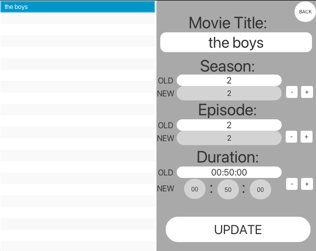
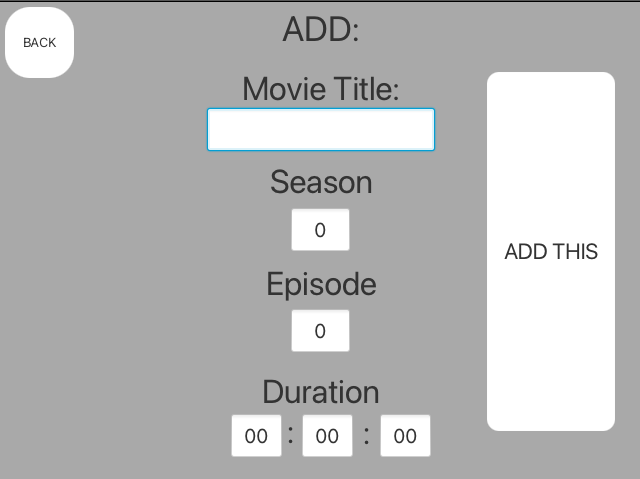
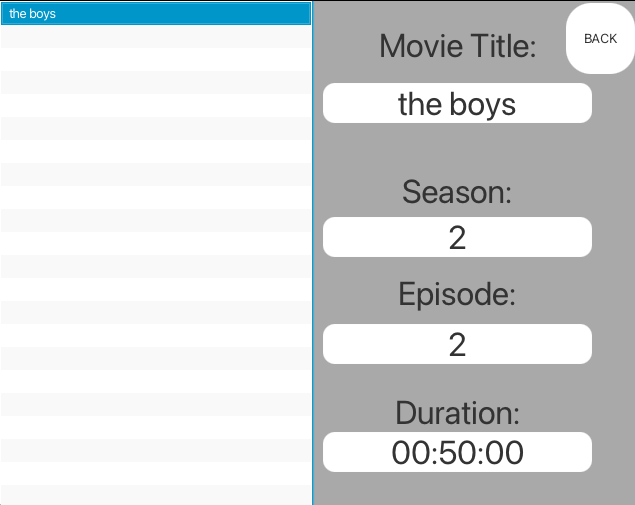

# ABOUT

An old Java project of mine. I used to watch a lot of movies, however found it annoying to keep track of movies, and series and how far along i was with each of them. To help with this, i made an application allowing to add, check, and edit your progress of different movies and series. This involed theuse of JavaFX and File Writing and Reading.

# IMAGES

> EDIT MOVIES

> ADD MOVIES

> CHECK PROGRESS
 
